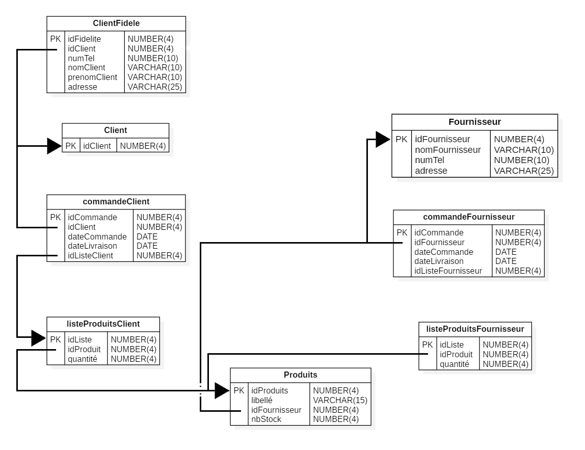
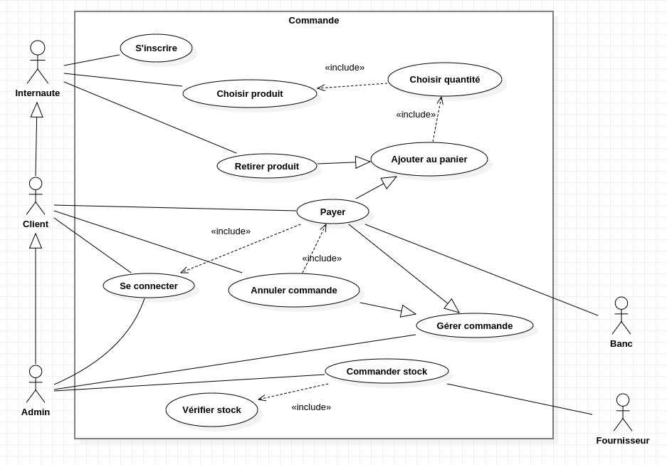
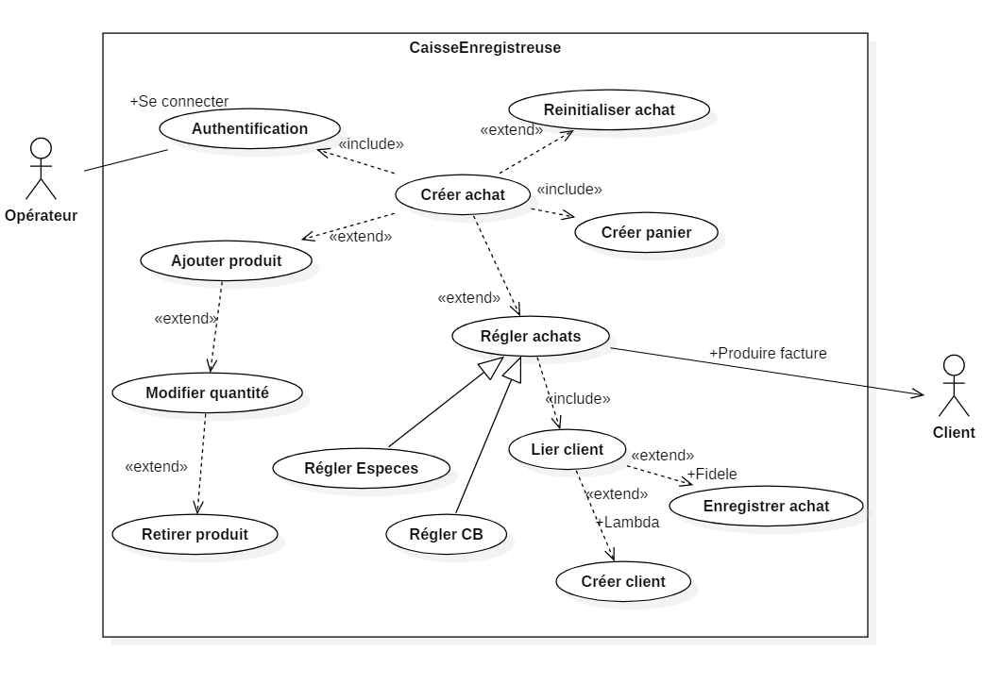

#  Projet S3 
### IUT Montpellier-Sète – Département Informatique
* **Lien du projet:** N'EST PLUS HEBERGE
* **Tuteurs:** [Sébastien Gagné](mailto:sebastien.gagne@umontpellier.fr)
* **Colaborateurs :** [Xavier Corbier](mailto:xavier.corbier@umontpellier.fr), [Muhammad Samsuddin](mailto:muhammad.samsuddin@etu.umontpellier.fr), [Arnaud Paget](mailto:arnaud.paget@etu.umontpellier.fr), [William Viala](mailto:william.viala@etu.umontpellier.fr)
* Le raport est à rendre avant le 6 Janvier 2020.
* Un amphi sera mis en place pour préparer la soutenance.
* Les soutenances se déroulent le 8 ou 9 Janvier 2020.

### Sujet - Gestion de boutique commerciale
L'idée est de simuler, par une application web, la gestion d'une boutique type épicerie. Le commerçant doit pouvoir, par son interface admin, avoir un suivi de ses stocks, pouvoir créer de nouvelles entrées dans ses stocks, entrer une livraison, ... Il pourra aussi gérer les achats des clients (fonctionnement de caisse enregistreuse) et avoir un historique précis des achats de tel ou tel client. Le système de carte de fidélité, dont les modalités sont à discuter, sera à mettre en place. L'interface web client classique permettra d'afficher les articles mis en valeur au cours de promotions, ce qui pourra être renforcé par des actions du serveur (mails automatiques). L'interface web client permettra aussi au client titulaire d'un compte de passer une commande qui sera ainsi préparable à l'avance. Toute fonctionnalité supplémentaire bienvenue.

### Déroulement du projet

#### Phase 1 : Conception et mise en route du projet

##### Etape 1 - Modèle MCD
Nous avons mis en place un modèle MCD afin de clarifier le sujet.

##### Etape 2 - Structure du projet
Nous avons choisi d'utiliser la structure MVC vu en cours pour avoir un code propre. Nous avons également vu les différents contrôlleur qu'il y aura dans le site ainsi que ses différentes vues.

##### Etape 3 - Création du système de versionning : Github
Nous avons utiliser Github afin de pouvoir chacun travailler de notre côté sur des extensions et ensuite les assembler.

#### Phase 2 : Définition et planification du projet

##### Etape 1 - Diagramme de cas d'utilisation
Nous avons décrit différents cas d'utilisation.
A travers un premier diagrame général du site web.

Et un diagramme plus précis sur la caisse enregistreuse.

##### Etape 2 - Choix de la méthode d'organisation
Sachant que le site évoluera en fonction des demandes du client, nous avons choisi d'utiliser une méthode Agile pour gérer le projet.
* Product Owner : Xavier Corbier
* Scrum Master : Xavier Corbier
* Développeur : William Viala, Xavier Corbier, Arnaud Paget, Muhammad Samsuddin
###### Product Backlog

##### Etape 3 - Répartition des tâches
Afin de répartir les tâches à effectuer au mieux, nous avons choisi d'utiliser l'outil [Trello](https://trello.com). Celui-ci nous permettra à travers les colonnes "A faire", "En cours", "Fait", "Validé", "A refaire", de savoir au mieux l'évolution du sprint.

##### Etape 4 - Diagramme Gant

